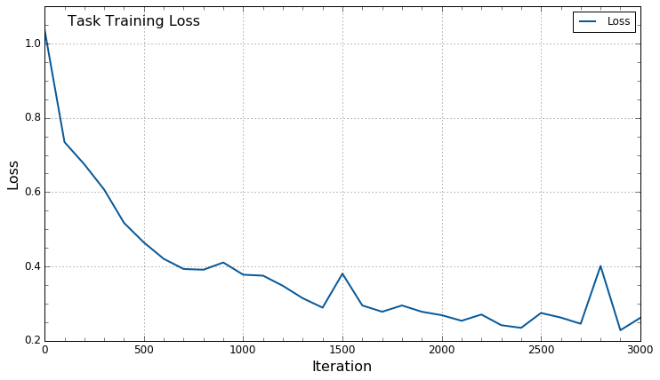

# Neulite

Neulite is a light framework for Neural Networks written in Python and
Numpy to shine some light on how they work.

(For the state of the repository on 27/10/2017, see the `initial commit` branch)

## Clone

Since this repository contains a submodule, you need to use the --recursive flag:

```
git clone --recursive https://github.com/creoin/neulite.git
```

This will also download the data_tools repository.

## How to run

An example has been included in `run.py`, and is explained briefly below. A walkthrough the code has also been included in the `notebook_task` jupyter notebook.
From the root directory of the repsitory:

```
import neulite as nl
import data_tools as dt
```

### Setup the data

Firstly setup the data, the Iris dataset has been included in `data/iris`:

```
filepath = 'data/iris/iris.data'
data_manager = dt.IrisData(filepath, (0.7,0.15,0.15))
data_manager.init_dataset()
X, Y = data_manager.prepare_train()
X_valid, Y_valid = data_manager.prepare_valid()
```

This will read the Iris data, prepare it into a Train/Validation/Test split, by the `(train, valid, test)` tuple supplied to the `DataManager`. With an even random selection over the three classes, and converting the labels to a 1-hot encoding.

### Build the network

Next setup a `NeuralNet` like so:
```
my_net = nl.NeuralNet(4, lr=1e-1)
my_net.set_regulariser(nl.L2Regulariser(1e-3))
my_net.set_cost(nl.SoftmaxCrossEntropyLoss())
```
where the arguments to `NeuralNet` are the input example dimension, and learning rate. Here an `L2Regulariser` with a lambda parameter of `1e-3`, and a `SoftmaxCrossEntropyLoss` has been set.

Next build up the architecture of the layers:
```
my_net.add_layer(nl.FCLayer(100))
my_net.add_layer(nl.ReluLayer(100))
my_net.add_layer(nl.DropoutLayer(100, keep_prob=0.7))
my_net.add_layer(nl.FCLayer(3))
```
where the numbers correspond to the number of hidden units in the layers. The ReLU and Dropout layers operate on the layer below, so have the same number of units. Here a network of essentially two Fully-Connected (FC) layers is built, one with 100 hidden units and the top with 3 units to match the number of classes.

### Training

```
num_examples = len(X)
for i in range(10001):
    my_net.feed(X, Y)
    probabilties, loss = my_net.forward()
    d_loss_input = my_net.backward()
    if i % 1000 == 0:
        avg_loss = np.sum(loss)/num_examples
        predicted_class = np.argmax(probabilties, axis=1)
        ground_truth = np.argmax(Y, axis=1)
        train_accuracy = np.mean(predicted_class == ground_truth)
        # similar can be done for X_valid and Y_valid

        print('Iteration {:10}: loss {:6.3f} train accuracy {:7.3f}'.format(i, avg_loss, train_accuracy))
```

### Example Output

Below is some example output from a Task dataset (not included in repo), which is a simple distribution of 3 classes in 2 coordinates. This example was taken from the `notebook_task` jupyter notebook.

Training progress:
```
num_examples: 12000
Iteration          0: loss  1.059 train accuracy   0.396 valid accuracy   0.373
Iteration       1000: loss  0.187 train accuracy   0.945 valid accuracy   0.951
Iteration       2000: loss  0.206 train accuracy   0.941 valid accuracy   0.937
Iteration       3000: loss  0.192 train accuracy   0.945 valid accuracy   0.936
Iteration       4000: loss  0.185 train accuracy   0.945 valid accuracy   0.947
Iteration       5000: loss  0.175 train accuracy   0.948 valid accuracy   0.953
Iteration       6000: loss  0.174 train accuracy   0.949 valid accuracy   0.959
Iteration       7000: loss  0.189 train accuracy   0.942 valid accuracy   0.955
Iteration       8000: loss  0.175 train accuracy   0.948 valid accuracy   0.959
Iteration       9000: loss  0.169 train accuracy   0.950 valid accuracy   0.957
Iteration      10000: loss  0.167 train accuracy   0.950 valid accuracy   0.957
```

Training and Validation Accuracy:


Training Loss:

